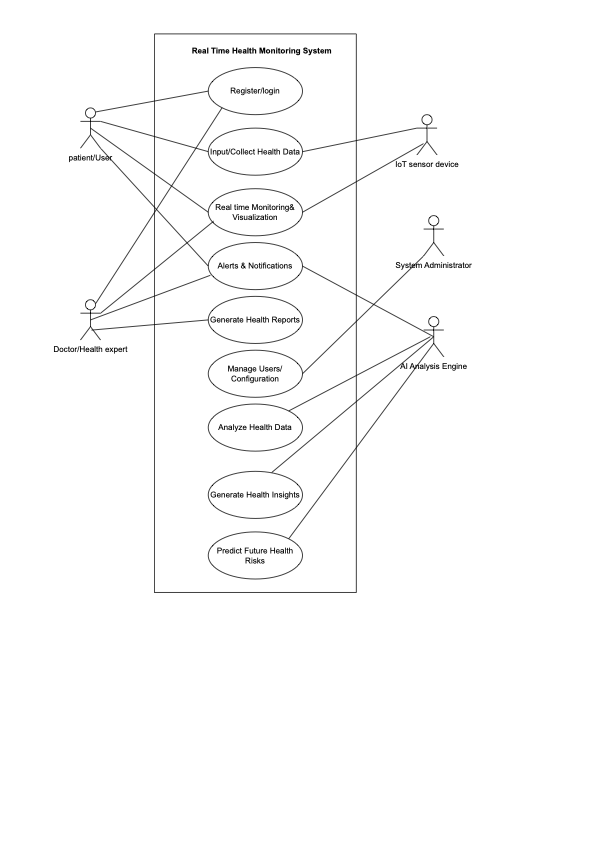
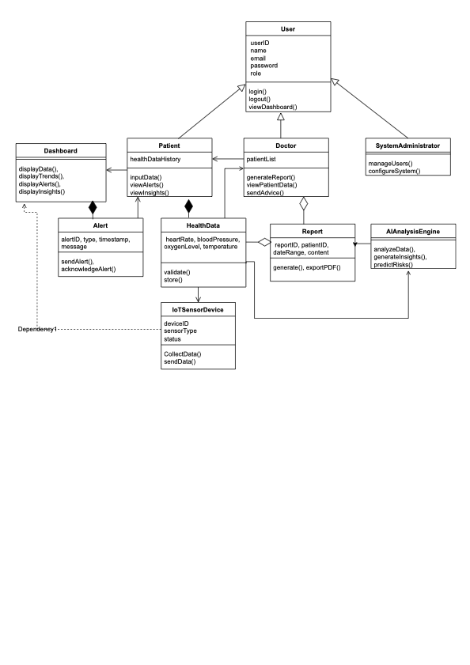

# LifePulse: Use Case Model
 #### This section introduces the purpose of the LifePulse system’s use cases and explains how each actor interacts with the system to achieve key objectives.

 

## 1. Key Actors
| Actor | Type | Role |
|-------|------|------|
| Patient/User | Primary | -  Inputs health data manually or via sensors  -  Views dashboard  -  Receives alerts|
| Doctor/Health Expert | Primary | -  Monitors patient data  -  Provides advice based on insights |
| IoT Sensor | External | -  Collects and transimits real-time health matrics |
| AI Engine | External | -  Analyzes data  -  Detects anomalies  -  Predicts health risks |
| System Administrator | Supporting | -  Manages users, system settings, and security |

  
## 2. Use Cases

### UC01 - Register/Login
  -  Actors: Patient, Doctor, Admin
  -  Goal: To securely create an account or access the system using valid credentials.
  -  Main Flow:
      1. The actor opens the system (web or mobile app).
      2. The actor selects “Register” or “Login.”
      3. For registration, the actor provides name, email, password, and role (Patient,
Doctor, or Admin).
      4. The system validates input and encrypts credentials.
      5. The account is created and stored securely in the database.
      6. For login, the actor enters credentials.
      7. The system authenticates the user and redirects to the personalized dashboard.
  -  Alternative Flows:
      -  Invalid credentials → The system displays an error and prompts retry.
      -  Forgotten password → User selects “Forgot Password,” receives a verification email,
and resets password.
      -  Network issue → The system notifies the user and retries connection.
      -  Unauthorized role attempt → The system denies access and logs the incident. 

 

### UC02 - Input/Collect Health Data
  -  Actors: Patient, IoT Device
  -  Goal: To collect health readings either automatically from sensors or manually by the user.
  -  Main Flow:
      1. IoT sensors (e.g., smartwatch) connect to the system.
      2. Device sends real-time readings such as heart rate, oxygen level, and blood pressure.
      3. Data is timestamped and stored in the cloud database.
      4. The patient can also manually input readings through the dashboard.
      5. The system validates the input (range check, format check).
      6. Data is transmitted to the AI Analysis Module for processing.
  -  Alternative Flows:
      -  Device disconnected → The system retries connection or prompts manual entry.
      -  Invalid input → The system requests correction.
      -  Transmission delay → The system queues data and updates once connection is
restored.
      -  Duplicate readings → The system flags and filters duplicates.

 

### UC03 - Real-Time Monitoring
  -  Actors: Patient, Doctor, IoT Device
  -  Goal: To provide continuous, real-time visualization of patient health data.
  -  Main Flow:
      1. IoT devices continuously send health data to the system.
      2. The system updates the dashboard automatically with each new reading.
      3. Visualizations (charts, indicators) display live data for heart rate, BP, oxygen level, etc.
      4. Users can view daily, weekly, and monthly summaries.
      5. Doctors can monitor multiple patients simultaneously.
  -  Alternative Flows:
      - No incoming data → Display “No Data Available” message.
      - Slow internet → Data is buffered and displayed once stable.
      - Corrupted readings → System discards invalid values and logs error.
      - Device sync failure → The system attempts reconnection automatically.

 

### UC04 - Alerts & Notifications
  -  Actors: Patient, Doctor, AI Engine
  -  Goal: To notify users and doctors of abnormal or risky health readings.
  -  Main Flow:
      1. AI Engine analyzes incoming data.
      2. When readings exceed safe thresholds, the system generates alerts.
      3. Alerts are sent to the patient and doctor via in-app notifications, email, or SMS.
      4. The alert message includes details of the abnormal parameter and recommended
action.
      5. All alerts are timestamped and stored in the alert log.
  -  Alternative Flows:
      - False positive alert → User or doctor can mark it as reviewed.
      - Notification service offline → System stores alert and sends once reconnected.
      - Low severity alerts → Shown as warnings rather than urgent messages.
      - AI service downtime → Temporary rule-based alerting is used instead.
   
 

### UC05 - Generate Health Reports
  -  Actor: Doctor
  -  Goal: To produce reports summarizing patient health over a selected time period.
  -  Main Flow:
      1. The doctor selects a patient and a time range.
      2. The system retrieves relevant historical health data.
      3. Charts and tables summarize trends and critical events.
      4. The report is generated and displayed.
      5. The doctor can download or export it (PDF or CSV).
  -  Alternative Flows:
      - No available data → Display message: “No data for selected period.”
      - Report generation failure → System retries or prompts to reselect parameters.
      - Cancelled process → System aborts generation and logs the event.

 

### UC06 - Analyze Health Data
  -  Actor: AI Engine
  -  Goal: To process health readings and detect abnormalities, trends, and patterns.
  -  Main Flow:
      1. Collected data is sent to the AI Analysis Module.
      2. The AI processes metrics using machine learning models.
      3. It identifies deviations, trends, or potential risks.
      4. Results are stored in the database and forwarded to the Insights Module.
      5. Alerts are triggered if anomalies are found.
  -  Alternative Flows:
      - Incomplete data → AI requests missing values or flags low accuracy.
      - Processing errors → Logs issue and retries analysis.
      - Model update → System pauses analysis during retraining.

 

### UC07 - Generate Health Insights
  -  Actor: AI Engine
  -  Goal: To produce personalized recommendations and lifestyle advice based on user data.
  -  Main Flow:
      1. AI Engine uses analyzed data and patient history.
      2. It generates recommendations (e.g., “Increase activity,” “Consult a doctor”).
      3. Insights are displayed on the patient dashboard.
      4. Doctors can view AI insights for treatment decisions.
  -  Alternative Flows:
      - Inconsistent data → System generates limited insights with accuracy notice.
      - AI model unavailable → Default rules generate basic suggestions.
      - Outdated data → System notifies user to sync latest readings.

 

### UC08 - Predict Future Health Risks
  -  Actor: AI Engine
  -  Goal: To forecast potential health issues using historical and current data trends.
  -  Main Flow:
      1. AI Engine retrieves patient’s long-term health data.
      2. Predictive models assess patterns for potential risks (e.g., hypertension).
      3. Forecast results are displayed with risk levels (Low/Medium/High).
      4. The system recommends preventive measures.
      5. Predictions are logged for comparison over time.
  -  Alternative Flows:
      - Insufficient data → AI notifies user that prediction accuracy is low.
      - Prediction error → Model logs error for debugging.
      - Model update → Predictions temporarily paused during retraining.

 

### UC09 - Manage User/Configuration
  -  Actor: System Administrator
  -  Goal: To manage user roles, permissions, and system settings.
  -  Main Flow:
      1. Admin logs in securely with administrator credentials.
      2. Admin can view, add, or remove users (patients/doctors).
      3. Admin adjusts system parameters (thresholds, update intervals).
      4. Admin monitors system uptime and logs.
      5. Admin can trigger system backups and restore data if needed.
  -  Alternative Flows:
      - Unauthorized access attempt → System denies and logs event.
      - Configuration error → System rolls back to previous safe settings.
      - Session timeout → Admin is logged out for security reasons.

  
## 3. UML Diagrams
#### Two UML diagrams are provided that shows the flow of the system
   1. Use Case Diagram
      - 
   2. Class Diagram
      - 

##### The diagrams can be accessed in the `assets/` folder as well

